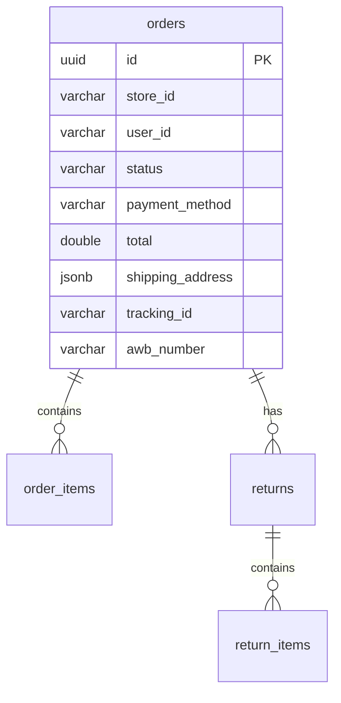

# order-service

Orders, line items, and returns. Port **3005**, schema **`order_svc`**.

Platform design: [System design](https://github.com/digi-carts/doc/blob/main/architecture/system-design.md)

## Domain

An order belongs to a `store_id` and `user_id`, has status, payment method, JSON shipping address, and courier/tracking fields filled after fulfillment. Nested `OrderItem` snapshots `product_id`, name, qty, and `price_at_order`. Returns and `ReturnItem`s hang off the order.

Gateway also routes `/api/cart/**`; there is **no cart controller** in this service today (cart is client-side Zustand in storefront).

## Tech stack

Java 21, Spring Boot 3.3.0, Web, JPA, Validation, Liquibase, PostgreSQL.

`OrderStatus`: `PENDING`, `PROCESSING`, `SHIPPED`, `DELIVERED`, `RECEIVED`, `CANCELLED`.

## Data model



## HTTP API

Gateway: `/api/orders/**`, `/api/cart/**`, `/api/returns/**`.

### Orders — `/orders`

| Method | Path | Notes |
|--------|------|--------|
| GET | `/orders` | Filter `storeId`, `userId`, `status` |
| GET | `/orders/{id}` | |
| POST | `/orders` | `OrderRequest` |
| PUT | `/orders/{id}` | |
| DELETE | `/orders/{id}` | 204 |

### Returns — `/returns`

| Method | Path |
|--------|------|
| GET | `/returns` | Filters analogous to orders |
| GET | `/returns/{id}` |
| POST | `/returns` |
| PUT | `/returns/{id}` |
| DELETE | `/returns/{id}` |

### Health

`GET /health`

Headers: `X-User-Id`, `X-User-Role`.

## Checkout collaboration

Typical flow (see platform sequence diagrams):

1. Storefront cart → create order here
2. `catalog-service` `POST /products/deduct-stock`
3. `payment-service` payment order
4. `shipping-service` shipment
5. `billing-service` bill
6. `offer-service` `POST /api/offers/{id}/use`

Services currently do **not** orchestrate this internally; UIs / future saga layer coordinate HTTP calls.

## Configuration

| Variable | Required | Default |
|----------|----------|---------|
| `DATABASE_URL` | yes | schema `order_svc` |
| `PORT` | no | `3005` |

## Local run

```bash
export DATABASE_URL="jdbc:postgresql://localhost:5432/digicarts?currentSchema=order_svc"
mvn spring-boot:run
```

## CI/CD

`digi-cart-order-service-dev` / `digi-cart-order-service`.

## Related

- [catalog-service](https://github.com/digi-carts/catalog-service/blob/stage/doc/README.md)
- [payment-service](https://github.com/digi-carts/payment-service/blob/stage/doc/README.md)
- [shipping-service](https://github.com/digi-carts/shipping-service/blob/stage/doc/README.md)
- [billing-service](https://github.com/digi-carts/billing-service/blob/stage/doc/README.md)
- [storefront](https://github.com/digi-carts/storefront/blob/stage/doc/README.md)

## REST API reference

See [api.md](api.md) for every HTTP endpoint generated from Spring controllers.
